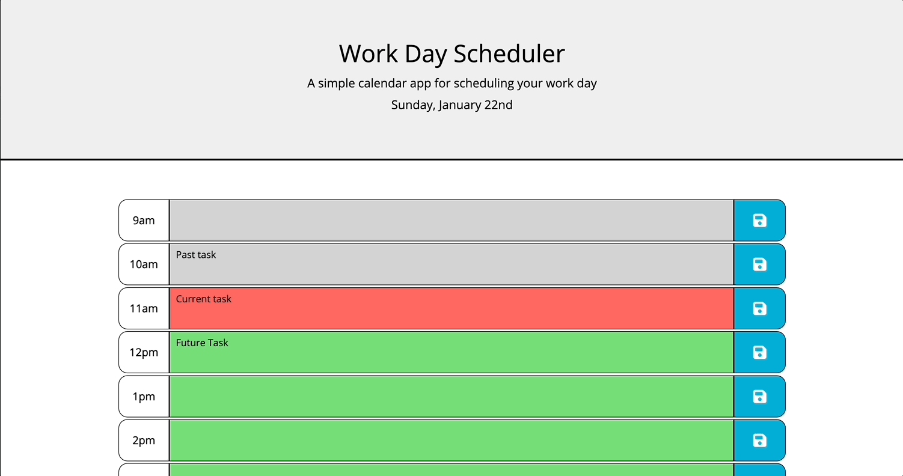

# Daily Planner App
## Description
In this assignement I had to create an app that runs in the browser and features dynamically updated HTML and CSS, powered by jQuery.

My task was to create a simple calendar application that allows a user to save events

Using Moment.js library to work with date and time

The acceptance criteria for this exercise were as follow:

* Display the current day at the top of the calender when a user opens the planner.
 
* Present timeblocks for standard business hours when the user scrolls down.
 
* Color-code each timeblock based on past, present, and future when the timeblock is viewed.
 
* Allow a user to enter an event when they click a timeblock

* Save the event in local storage when the save button is clicked in that timeblock.

* Persist events between refreshes of a page
 

The application fully rensponsive for all the screen sizes.

### Link to the deployed application 
https://rafdimartino.github.io/module-7-challenge-daily-planner-app/

## Installation
N/A

## Usage
The following animation demonstrates the application functionality:

## Credits
N/A

## License
Please refer to the LICENSE in the repo.